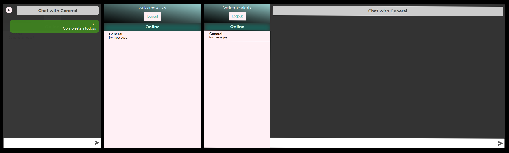

# React and PHP chat

I was designing a protocl to make a real time communication between a server and many clients in order to implement a online playing version of tic tac toe. To test the protocol I designed this little chat. Some important features are:

- Individual and general rooms.
- Unread messages notification.
- Client disconnection notification.
- "Typing..." message to let you know the other person is active

## Preview

`youtube: https://youtu.be/rTRnT-IngNw`

## Important features

### Keyboard usage

The whole application can be used with the keyboard only. All the commands can be fired with the use of tab key and enter.

### Responsive design

It is no secret that every modern application must be adaptable to every kind of devices. At least on those it is intended to be used. This little app handles this requeriment and the result is the following:

