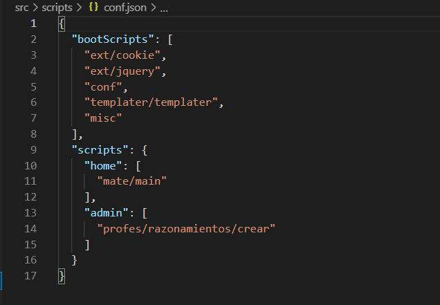

# Programmatic details

As this was the first application I developed entirely, the implemented technology is pretty old. To be clear: The only frameworks used was jQuery and Sass. The most code was written in pure javascript, html and php. However, there are some details that are very interesting from my point of view. I intend to highlight some of them above.

The first aspect to highlight is that, besides the app has no transpiler, the whole code is keeped encapsulated. To do so, I used a custom PHP code that I wrote.

Every time a client makes a request against the app, a php script is loaded through the .htaccess on the script.js call. This php script bootstraps the necessary code to serve the current route and returns an unique file. But the truth is that all the code is organized in a directories tree, giving the opportunity to find bugs faster and scale the application better.



Another important face of the app is that it has a php code which name is *templater*. This script is in charge of providing the templates to each view of the application. Even a subroutine can load a template and use it as it wishes. The most important task was to provide the *professors* templates. Each template is made by several functions, each one of those return when called a html fragment and accept an array as argument to replace placeholders. Each load can be done at the bootstrap stage and provided to the client within the script.js file or during the runtime, in which case it's made asynchronously.

You can find more information about the templater [here.](/en/apps/matemagics/templater)

## What could be better?

I developed this app as a tool to teach my stepson maths. I had little free time and was looking for a way in which he could improve his skills. My goal was not to build a perfect application but a functional one. Thus, it has some lacks in quality, I am sorry for that.

This way, there are some aspects that I would like to improve:

1. The *parsers* are called one by one with the whole content of a script as parameter and return it modified. To do so, they search through the content using regular expressions and make the replacements to allow the usage of *syntactic sugar* within the scripts. This may have performance issues if the scripts are too long. To **improve** this functionality, I should have declared the regular expressions of each parser publicly and let the scripter decide when to call to a parser or not, only with the portion of the string that matter.

2. To improve the performance, I could have implemented a cache system. This way, each route would be processed only once. Nowadays, it processes and bootstraps the whole scripts each time it's requested. It is a very problematic aspect and must be improved.

3. The app is not made in order to accept multiple languages or different devices. It is intended to be used through a desktop computer and by a user who can read spanish. 

4. The app is designed to accept a trace of the students activities in order to make advices and offer statistics of the student's performances. This face was not developed but it can be done at any time.

## Syntactic sugar

The scripts are pre processed in PHP, in this stage the processor replaces some commands to offer an easier usage. It is possible to include templates through the **@Templates** directive or load scripts throught **require**. Those commands are written in a javascript script and are replaced by the scripter. 

### Adding parsers

To add custom syntactic sugar it is possible to make a new file within the *parsers* directory. It must have declared a class with the same name that the file and the scripter will load it automatically. In order to get an example please look at the source files.

### require "scriptName";

This directive loads a script before executing the current one. This way it's possible to make dependencies between the scripts without using a transpiler.

### $@Template "templateName, otherTemplateName";

It allows to load templates directly to the professors.

## Entities interaction

### Mate 

It is the coordinator entity, it lists the available professors and allows the user to create new instances of the exercises. To do so, it offers a menu. Each item of the menu offers a dialog box when is pressed to configure the exercise. Once the exercise is created, the mate entity look after the answers the user provides. 

Each exercise is stored in localStorage to prevent the user from refreshing the page when he dislikes the current exercises.

### Profesor

It is a javascript class that must be extended when a new professor must be created. It gives tools to the new professors to make their exercises and work with Mate.

Each professor is a virtual entity which generates exercises to try to teach it's subject. It's in charge of generating the view to the user. When the view is finished, it returns to the mate the reference of each input field and the expected answer.

#### Usage without comments

```js
class Cuentas extends Profesor {
  static info = {
    nombre: "Cuentas",
    breve: "Realiza las siguientes cuentas",
  }
  
  static required = {
    cantidad: { title: 'Cantidad de operaciones', type: 'number' , default: 12, max: 40, min: 4},
    cifrasSuma: { title: 'Cifras de suma', type: 'number', default: 5, max: 6, min: 1 },
    cifrasResta: { title: 'Cifras de resta', type: 'number', default: 4, max: 6, min: 1 },
    cifrasDivision: { title: 'Cifras de división', type: 'number', default: 1, max: 6, min: 1 },
    cifrasMultiplicacion: { title: 'Cifras de multiplicación', type: 'number', default: 3, max: 6, min: 1 },
    restaNegativo: {title: '¿Resta negativo?', type: 'check', default: false }
  }
  
  init() {
    $@Templates "cuentas";
    
    this.addPreloader(this.makeData);
  }
  
  makeData(resolve) {  
    let operadores = ['-', '+', '*', '/'], cantidad = this.conf.cantidad;

    let revive = [];
    for(let i=0; i < cantidad; i++) {
      let operador = operadores[cantidad % operadores.length]; 

      let a = Math.random() * (10**this.conf.cifrasSuma), b = 10;
      switch(operador) {
        case '+':
          b = b ** this.conf.cifrasSuma;
          break;
        case '-':
          b = b ** this.conf.cifrasResta;
          break;
        case '*':
          b = b ** this.conf.cifrasMultiplicacion;
          break;
        case '/':
          b = b ** this.conf.cifrasDivision;
          break;        
      }
      b = parseInt(Math.random() * b);
      revive.push({a,b,operador});
    }
    
    this.set(revive);
    resolve();
  }
  
  buildView() {
    let template = this.tempates.cuentas(), operadores = ['+','x','-','/'];

    for(let cuenta of this.data) {
      let {a, b, operacion} = cuenta;
      
      let plantillaCuenta = template.cuenta({A:a, B:b, operacion: operadores[operacion]});
      
      this.append(plantillaCuenta);
      
      this.push({
        text: cuenta.find('input'),
        answer: this.resolve(a,b,operacion)
      })
    }
  }

  resolve(a, b, operacion) {
    return eval(`${a} ${operacion} ${b}`);
  }
}

```

#### Usage with comments

```js
class Cuentas extends Profesor {
  /**
   * @static info
   * 
   * Esta propiedad debe ser modificada para establecer la información pública de la entidad que se está desarrollando. Mate tomará las propiedades *nombre* y *breve* de info para mostrar al usuario.
   * 
   * */
  static info = {
    nombre: "Cuentas",
    breve: "Realiza las siguientes cuentas",
  }

  /**
   * @static required
   * 
   * La propiedad estática required es utilizada por mate para establecer el cuadro de diálogo de configuración.
   * 
   * Cada clave de este objeto será un parámetro de configuración disponible para el usuario. Así mismo cada clave será también un objeto indicando el tipo, los márgenes y el título a utilizar para cada propiedad configurable.
   * 
   * */
  static required = {
    cantidad: { title: 'Cantidad de operaciones', type: 'number' , default: 12, max: 40, min: 4},
    cifrasSuma: { title: 'Cifras de suma', type: 'number', default: 5, max: 6, min: 1 },
    cifrasResta: { title: 'Cifras de resta', type: 'number', default: 4, max: 6, min: 1 },
    cifrasDivision: { title: 'Cifras de división', type: 'number', default: 1, max: 6, min: 1 },
    cifrasMultiplicacion: { title: 'Cifras de multiplicación', type: 'number', default: 3, max: 6, min: 1 },
    restaNegativo: {title: '¿Resta negativo?', type: 'check', default: false }
  }

  /**
   * @method init(): void
   * 
   * Aquí se establecerán las bases de la clase, indicando a la aplicación qué plantillas son necesarias para el desarrollo de la vista y qué preloaders son necesarios para el desarrollo de la información.
   * 
   * */
  init() {
    // Se indica que la plantilla de nombre "cuentas" debe estar disponible para el desarrollo de la vista
    $@Templates "cuentas";

    // Agrega el método makeData de la clase como preloader, más detalles sobre preloaders más abajo.
    this.addPreloader(this.makeData);
  }
  
  // Esta función es específica de la clase Cuentas, en ella se crean las cuentas específicas para la configuración establecida por el usuario. Para detalles de implementación ver el repositorio en github.

  // A continuación se exponen los recursos disponibles para cualquier preloader con un ejemplo ilustrativo
  makeData(resolve) {  
    let operadores = ['-', '+', '*', '/'];

    // La propiedad this.conf existe ya que Mate y la clase padre Profesor la generaron a partir del parámetro required establecido en la clase y su contenido es el resultado del cuadro de diálogo mostrado al usuario.
    let cantidad = this.conf.cantidad;

    let revive = [];
    for(let i=0; i < cantidad; i++) {
      let operador = operadores[cantidad % operadores.length]; 

      let a = Math.random() * (10**this.conf.cifrasSuma), b = 10;
      switch(operador) {
        case '+':
          b = b ** this.conf.cifrasSuma;
          break;
        case '-':
          b = b ** this.conf.cifrasResta;
          break;
        case '*':
          b = b ** this.conf.cifrasMultiplicacion;
          break;
        case '/':
          b = b ** this.conf.cifrasDivision;
          break;        
      }
      b = parseInt(Math.random() * b);
      revive.push({a,b,operador});
    }

    // El método set indica a Mate que este objeto debe ser usado para restaurar el ejercicio en caso de que el navegador se cierre por ejemplo.
    this.set(revive);

    // Una vez que se haya terminado de generar la información necesaria para desarrollar el ejercicio, se debe llamar a resolve para que la aplicación continúe el proceso de renderizado.
    resolve();
  }

  /**
   * @method buildView
   * 
   * La implementación de este método debe dar como resultado una vista funcional.
   * 
   * */
  buildView() {
    // La plantilla cuentas fue declarada en el método init. Existe ya que esto en verdad es un atajo en el lenguaje que indica a la aplicación que dicha plantilla debe ser cargada y colocada dentro de la propiedad this.templates

    // Dicha propiedad contendrá todas las plantillas que sean declaradas. El detalle de utilización puede encontrarse en la sección de templater
    let template = this.tempates.cuentas();

    let operadores = ['+','x','-','/'];

    // this.data existe y contiene la información pasada en this.set() en los preloaders. No se establece la información directamente desde los preloaders ya que en realidad se puede alcanzar el método buildView desde una acción de usuario específica (crear nuevo ejercicio) o desde una restauración, cuando el navegador se cerró por accidente por ejemplo.
    for(let cuenta of this.data) {
      let {a, b, operacion} = cuenta;

      // Aquí se está creando una instancia de la propiedad de repetición cuenta de la plantilla cuentas y se le pasan los argumentos a, b y operacion. Ver declaración de la plantilla más abajo.
      let plantillaCuenta = template.cuenta({A:a, B:b, operacion: operadores[operacion]});

      // El método this.append agrega el resultado obtenido de la operación anterior al cuerpo del ejercicio
      this.append(plantillaCuenta);

      // El método this.push agrega una referencia a un cuadro de texto con su correspondiente respuesta. La respuesta puede ser bien un valor o una función, en cuyo caso se tomará el valor de retorno de la función como respuesta correcta.
      // El mismo recibe como parámetro un objeto con las propiedades text que hace referencia a el elemento input del DOM y answer cuyo valor ya fue aclarado en el comentario previo.
      this.push({
        text: cuenta.find('input'),
        answer: this.resolve(a,b,operacion)
      })
    }
  }

  resolve(a, b, operacion) {
    // Esta implementación es un poco simplista pero funciona para el caso. De acuerdo a la lógica de la clase actual, a y b siempre serán números enteros y operación siempre será un valor entre '+', '-', '/', '*'
    return eval(`${a} ${operacion} ${b}`);
  }
}

```

As it can be seen, it is possible to make any exercise. Through this API was created even the Geometry professor, which draws on a canvas random figures and then asks to the user to measure some distances in order to check the correctness of the user's draw.