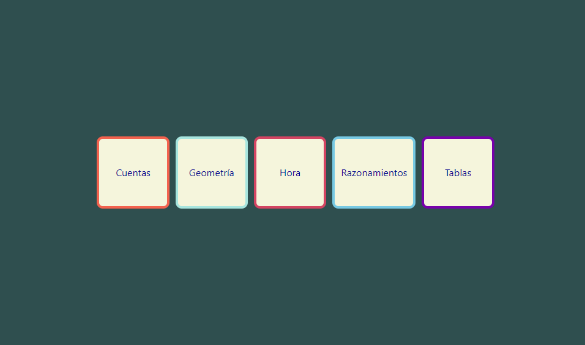
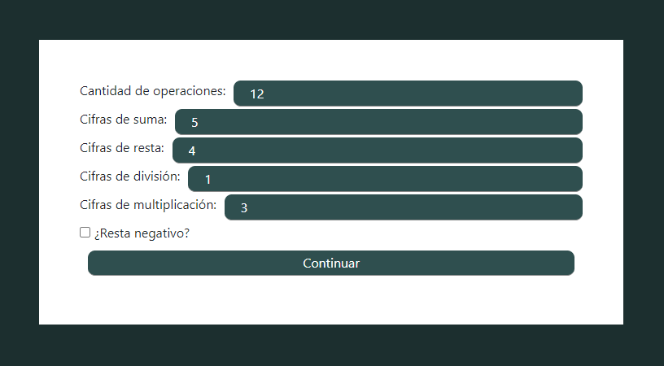
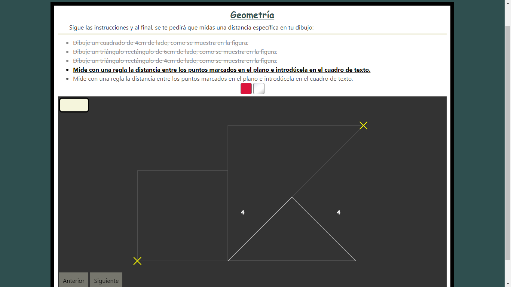

# Matemagics

The idea was to create an application which could save me time and effort in order to teach my child the basic skills on maths. He was in trouble and was not being able to overcome the difficulties inherent to his course and it worried me, at the same time I had too little free time and was not able to assist him as he needed. This is the result:

The application is structured by a coordinator entity which generates the common graphic interface to show to the user such as menues and supports the different professors that are served through the application. This way it is possible to add limitless teaching units, covering different educational necessities.

Nowadays there are 5 different areas in which the user can practice and develop skills: operations, gemoetry, timing-related, reasoning and tables. Each one develops its own processes in an independent way. They offer its own interface and handles the expected answers from the user, giving the coordinator the responsibility of updating the user interface whenever a correct or wrong answer are submited.

In order to allow different difficulty levels, depending on the user necessities, each entity exposes configurable arguments. Through them, the user can adjust the exercises to fit his necessities.

Furthermore, each entity can generate its own interface, offering the possibility to offer a great variety of contents. Even exercises on geometry, for example:

