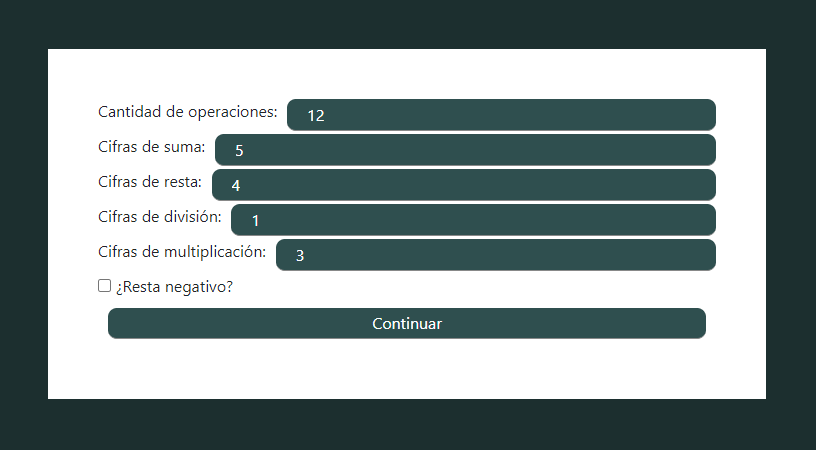

# Matemagica

La idea al crear esta aplicación fue poder enseñar a un niño en edad escolar los fundamentos de las matemáticas de una forma práctica y efectiva. En verdad esto responde a una necesidad de lograr que el niño con el cual convivo lograra sobrevivir a las exigencias escolares.

La estructura de la aplicación está conformada por una entidad coordinadora que se encarga de generar la interfaz general de usuario, mostrando los menú y dando soporte a cada una de las entidades encargadas de desarrollar un área en particular. De esta forma la idea fue desde un principio tener la posibilidad de agregar a futuro cuantas unidades particulares fuesen necesarias, pudiendo con cada una de ellas abarcar un área diferente de la enseñanza.

Al momento existen 5 áreas en las que la aplicación puede ofrecer ejercicios al usuario: cuentas, geometría, hora, razonamientos y tablas. Cada una de ellas desarrolla sus procesos de forma completamente independiente del resto y de la aplicación en si, ofreciendo a la entidad coordinadora una lista de respuestas esperadas y es ésta quien en realidad se encarga de corregir las respuestas obtenidas por el usuario.

Con la idea de permitir varios niveles de dificultad, dependiendo de las necesidades de cada usuario, cada entidad expone una serie de parámetros configurables. Mediante los mismos es posible regular la cantidad y la intensidad de los ejercicios.

Además, cada entidad es capaz de generar los contenidos a su manera. Dando la posibilidad de ofrecer apoyo en cualquier área de las matemáticas, incluso la geometría:

Si te pareción interesante, podés seguir mirando detalles sobre este proyecto en las opciones que hay más arriba. Cualquier comentario que quieras dejarme, podés hacerlo más abajo.
